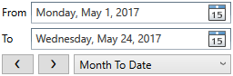

# Rh.DateRange.Picker
A WPF control for choosing date ranges. Derives from Control. Requires .NET Framework 4.0.


It shows 
- two date pickers for selecting dates, 
- list of predefined ranges, 
- buttons to step to the previous or the next range while preserving its meaning. For example, for the "Month To Date", if today is 5/24/2017, the previous range will be the period from 4/1/2017 to 4/24/2017.

For a complete demo of the control, check out the project Rh.DateRange.Picker.Examples.


## How To Install
Install the nuget package, or build Rh.DateRange.Picker and add reference to it
in your application project. 


## How To Use
Add the namespace mapping ```xmlns:rh="http://schemas.rollinghours.com/wpf"```
to your XAML. Create an instance of the control in your XAML file. Bind the From and To properties to the corresponding ViewModel properties.

### Minimal Use
Specify the From and To properties:
```xml
<rh:DateRangePicker From="{Binding DateFrom}" To="{Binding DateTo}" />
```
### Storing values in application settings
```xml
<Window 
...
xmlns:p="clr-namespace:MyProject.Properties">
...
  <rh:DateRangePicker From="{Binding DateRangeFrom, Source={x:Static p:Settings.Default}}"
                      To="{Binding DateRangeTo, Source={x:Static p:Settings.Default}}"
                      KindOfRange="{Binding DateRangeKind, Source={x:Static p:Settings.Default}}" />
 ...
</Window>
```
### Vertical layout
Use the Orientation property to control the internal layout of the control: 
```xml
<rh:DateRangePicker From="{Binding DateFrom}"
                    To="{Binding DateTo}"
                    KindOfRange="{Binding DateRangeKind}"
                    Orientation="Vertical" />
```



## Non-inherited properties and events
### Data-related properties
Property | Description
--- | ---
**From** | The start of range DateTime value. If set past the current **To** value, the **To** value also gets updated to the new **From** value. **KindOfRange** is set to Custom.
**To** | The end of range DateTime value. If set prior the current **From** value, the **From** value gets updated to the new **To** value. **KindOfRange** is set to Custom.
**KindOfRange** | Selected kind of range, one of the DateRangeKind enumeration values such as Today, WeekToDate, MonthToDate and others. When **KindOfRange** gets updated, the **From** and **To** properties are updated accordingly. The default is Today.
**Orientation** | The layout of the control. Horizontal layout places all the parts in one line, vertical layout splits the control into the 3 shorter lines. The default is Horizontal.
**FirstDayOfWeek**	| The DayOfWeek that represents the beginning of the week. The default is determined by the current culture. Can be set only once.
**SelectedDateFormat** | A DatePickerFormat that is used to display the selected date. The default is Long.
**Command** | The command to invoke when the date range is changed. 
**CommandParameter** | The parameter to pass to the **Command** property.

### Events
Event | Description
--- | ---
**DateRangeChanged** | Occurs when the date range is changed, just before the **Command** is fired.
                        
### UI-related properties						
Property | Description
--- | ---
**PreviousRangeButtonText** | The text displayed on the previous range button. The default is &#x276e;.
**NextRangeButtonText** | The text displayed on the next range button. The default is &#x276f;.
**SpacerHeight** | Vertical space between the elements when **Orientation** is Vertical. The default is 5.
**SpacerWidth** | Horizontal space between the control elements such as date pickers, navigation buttons and the kind of range combo box. The default is 5.
**DatePickerMinWidth** | **MinWidth** of the date pickers inside the control. The default is 220.
**DatePickerToCaptionMinWidth** | **MinWidth** of the label of the "To" date picker. Affects the horizontal space between the "From" and "To" date picker labels. The default is 24.
**NavigationButtonMinWidth** | **MinWidth** of the navigation buttons. The default is 24.
**RangeComboBoxMinWidth** | **MinWidth** of the kind of range combo box. The default is 120.
**DatePickerCaptionTextBlockStyle** |  The style that is used when rendering the "From" and "To" TextBlock elements that label the date pickers. Setting the properties **TextAlignment** and **VerticalAlignment** in this style has no effect. 
**NavigationButtonTextBlockStyle** | The style that is used when rendering the TextBlock content of the previous and next range buttons.

## Styling the internal controls
### How to avoid changing an internal control style of the DateRangePicker by a global default style
A default global style targeted to DatePicker, Button or ComboBox may affect the internals of the DateRangePicker. 
To avoid this, define the empty default style for the same target type but in the scope of the control. 
For example, if your default style is
```xml
    <Window.Resources>
        <ResourceDictionary>
            <Style TargetType="Button">
                <Setter Property="Background" Value="LightGreen"/>
                <Setter Property="Width" Value="75"/>
            </Style>
        </ResourceDictionary>
    </Window.Resources>

```
set the internal button style like this:
```xml
            <rh:DateRangePicker From="{Binding DateFrom}" To="{Binding DateTo}">
                <rh:DateRangePicker.Style>
                    <Style>
                        <Style.Resources>
                            <Style TargetType="Button" />
                        </Style.Resources>
                    <Style>
                </rh:DateRangePicker.Style>
            </rh:DateRangePicker

```
### How to apply a custom style to the internal elements
DateRangePicker has TextBlock, Button, DatePicker and ComboBox elements inside. 
TextBlocks can be styled with dedicated properties **DatePickerCaptionTextBlockStyle** and
**NavigationButtonTextBlockStyle**. To apply a custom style to the other elements, 
set your custom style as the default style for the target type like here:
```xml
            <rh:DateRangePicker From="{Binding DateFrom}" To="{Binding DateTo}">
                <rh:DateRangePicker.Style>
                    <Style>
                        <Style.Resources>
```
for navigation buttons:
```xml
                            <!--your custom style-->
                            <Style TargetType="Button">
                                <Setter Property="Background" Value="LightGreen"/>
                                <Setter Property="Width" Value="75"/>
                            </Style>
```
for date pickers:
```xml
                            <!--your custom style-->
                            <Style TargetType="DatePicker">
                                <Setter Property="BorderBrush" Value="CornflowerBlue"/>
                            </Style>
```
for the combo box:
```xml
                            <!--your custom style-->
                            <Style TargetType="ComboBox">
                                <!--your custom style-->
                                <Setter Property="Template" Value="{StaticResource ResourceKey=MyComboBoxTemplate}"/>
                            </Style>
                        </Style.Resources>
                    <Style>
                </rh:DateRangePicker.Style>
            </rh:DateRangePicker

```
